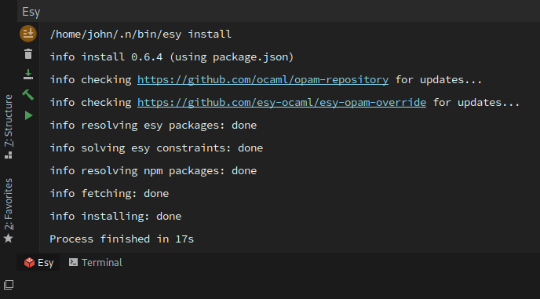

# Overview

Support for Esy is ongoing. The initial goal is to support Esy project detection and an esy tool window that allows you to run basic esy tasks.

Please tag any Esy feature requests with the `esy` tag.

# Setup

## Find the Esy Executable
To setup Esy, you'll first need to figure out where Esy is installed on your machine.

This can be done by running the `whereis` command (unix only):

```shell script
$ whereis esy
/home/john/.n/bin/esy # take note of this location
```
> Note: your location will probably be `/usr/local/bin/esy` if you installed npm with `sudo`

If you haven't installed Esy yet, please see the [installation instructions](https://esy.sh/docs/en/getting-started.html#install-esy).

## Configure the Plugin

Next you'll need to configure the plugin with this path to the Esy executable.

To do this, open **File > Settings > Languages & Frameworks > OCaml / Reason > Esy**
and provide the path to the Esy executable:


Click *Save* and attempt to run Esy by clicking on the Esy tool window.

> Note: you must be viewing an esy project for the Esy tool window to appear.

You should now be able to run Esy actions without issue:


